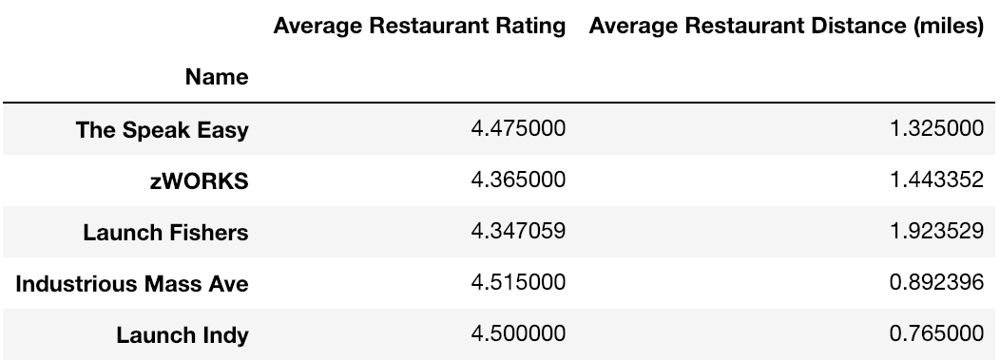
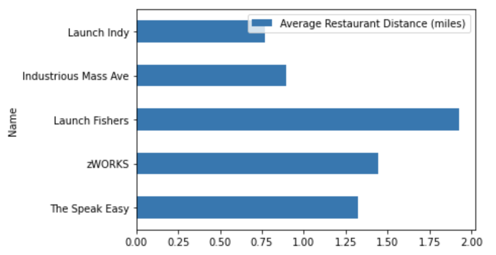
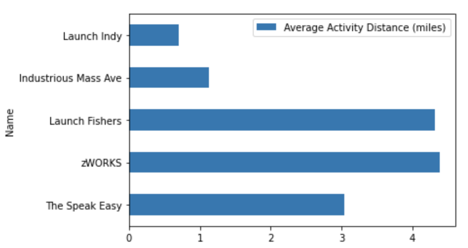
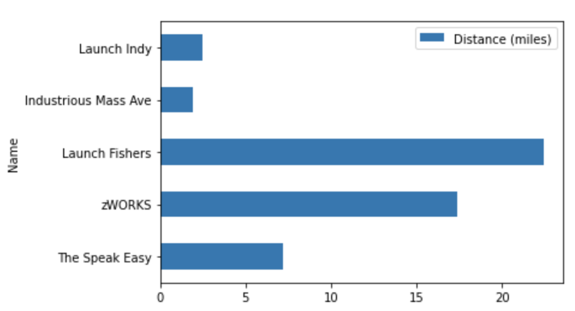

# Xtern Work Sample

## Introduction

I decided to follow the example 10-week activity plan of 10 weekly group dinners, 5 recreational activities, and one conference or Ted Talk event.

All of the workspaces have conference halls, but some don’t detail the capacity of their conference rooms. With this limited data and since we are conveniently hosted at IUPUI, Hine Hall Auditorium is the best choice.

For the recreational activities and group dinners, we’ll need to gather data on potential restaurants and venues.

## Methods

I used Google Maps API to find nearby restaurants and recreational options for each workspace. Then, I found the top 20 nearby restaurants and the top 10 recreational options for each workspace. To find the top 20 restaurants, I filtered out restaurants with a price level lower than 1, which are usually fast food options, then, sorted them based on rating. 

For the activities, I sorted them based on the amount of user reviews rather than rating value itself. Restaurants are often reviewed often and accurately; customers submit good and bad reviews. However, recreational places are hardly reviewed. When I initially ordered the activity places by rating, the top activity was an abandoned White Castle. Popular recreational places are reviewed by a larger number of people, so it's a better reflection of place quality.

In addition, I computed the distance between the housing and each workspace.

The data collected is limited. Google Maps API only allows for 60 results per query. I could only receive 60 results from nearby restaurants. I made separate queries for each type of activity, so there’s a decent amount of data collected on activities. However, those queries were still limited.

With this data, we can now choose the best workspace.

## Results

#### Average Distance and Rating of the Top 20 Restaurants

#### Average Distance of the Top 20 Restaurants (miles)

#### Average Distance of the Top 20 Activities (miles)

#### Distance from Housing (miles)

## Conclusion

I believe Launch Indy is the best workspace for Xterns this summer. 

It's proximal to housing. The average restaurant rating for it's top 20 restaurants is 4.5. It has the lowest average distance for nearby activities and nearby restaurants. In addition, it has the most diverse selection of activities in a 5 mile radius.

I created the plan assuming the Xtern program starts June 2, 2022.

### Plan

#### Week 1

Dinner:
June 2 - St. Elmo Steak House, 127 Illinois St, Indianapolis, IN 46225

#### Week 2

Dinner:
June 9 - Bluebeard, 653 Virginia Ave, Indianapolis, IN 46203	

Event:
June 10 - Tour with The HandleBar, 501 Madison Ave, Indianapolis, IN 46225

#### Week 3

Dinner:
June 16 - The Capital Grille, 40 W Washington St, Indianapolis, IN 46204

#### Week 4

Dinner:
June 23 - Slippery Noodle Inn, 372 S Meridian St, Indianapolis, IN 46225	

Event:
June 25 - Indiana State Museum, 650 W Washington St, Indianapolis, IN 46204

#### Week 5

Dinner:
June 30 - Café Patachou, 225 W Washington St, Indianapolis, IN 46204

Conference:
TED Speaker - Morra Aarons-Mele
Hine Hall Auditorium, 875 W North St, Indianapolis, IN 46202

#### Week 6

Dinner:
July 7 - Shapiro's Delicatessen, 808 S Meridian St, Indianapolis, IN 46225

Event:
June 9 - Concert or sports game at Gainbridge Fieldhouse, 125 S Pennsylvania St, Indianapolis, IN 46204

#### Week 7

Dinner:
July 14 - Iaria's Italian Restaurant, 317 S College Ave, Indianapolis, IN 46202

#### Week 8

Dinner:
July 21 - Ruth's Chris Steak House, 45 S Illinois St, Indianapolis, IN 46204

Event:
July 22 - Concert or event at Old National Centre, 502 N New Jersey St, Indianapolis, IN 46204

#### Week 9

Dinner:
July 28 - Chatham Tap Mass Ave, 719 Massachusetts Ave, Indianapolis, IN 46204

#### Week 10

Dinner:
August 4 - Harry & Izzy's, 153 Illinois St, Indianapolis, IN 46225, USA	

Event:
August 5 - Sports game at Lucas Oil Stadium, 500 S Capitol Ave, Indianapolis, IN 46225
